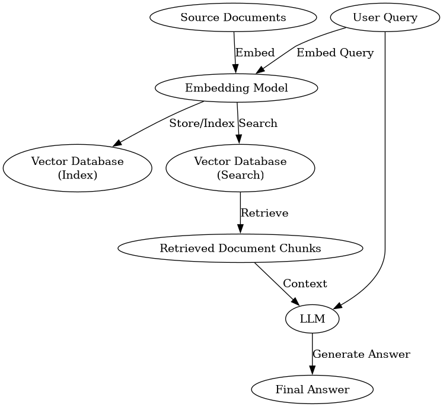

== Module 3: Retrieval-Augmented Generation (RAG) Basics

Building on our understanding of basic inference, this module introduces you to Retrieval-Augmented Generation (RAG). RAG is a powerful technique that allows language models to access and utilize external, up-to-date information beyond their initial training data. This is crucial for building applications that need to answer questions based on specific documents, databases, or real-time information, such as internal company knowledge bases or product catalogs.

By integrating RAG, your AI applications can provide more accurate, relevant, and verifiable responses.

By the end of this module, you will be able to:

* Understand the core concepts of Retrieval-Augmented Generation (RAG).
* Initialize and configure a RAG agent within the Llama Stack framework.
* Create and manage a Vector Database to store and search through your custom documents.
* Embed and index documents into the Vector Database.
* Use the RAG agent to retrieve relevant information from your documents and generate answers.

Ready to give your Llama Stack agent access to external knowledge?

Open the `03_RAG_Agent_Basic_Example.ipynb` notebook and follow the guided steps to implement your first RAG agent!

=== Reference Material

To complement your understanding of Retrieval-Augmented Generation (RAG) in Llama Stack, the following diagram visualizes the end-to-end RAG pipeline. This process is key to enabling LLMs to provide answers based on your specific documentation or data.

This diagram illustrates how source documents are processed and indexed into a vector database (the 'Indexing' phase) and then how a user query utilizes that indexed data to help the LLM generate a relevant and informed answer (the 'Querying' phase). Understanding this flow is crucial for debugging and optimizing your RAG applications.